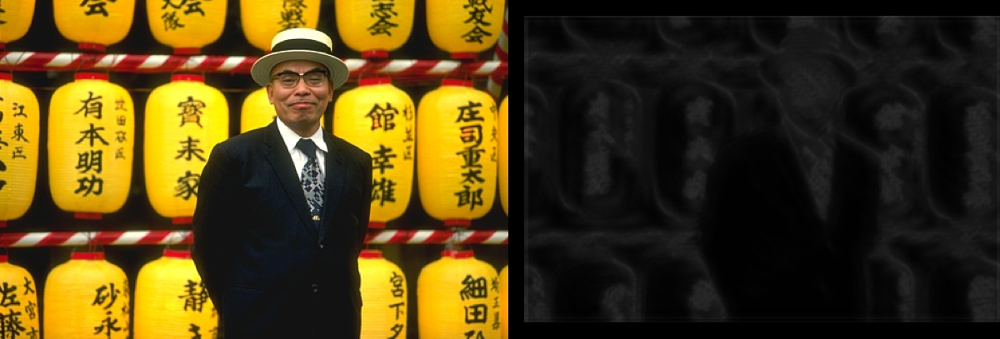

## README
This is my Final Project for CSCI 4830 - Computer Vision. It implements 
the mPb edge detector mentioned in the .pdf located at the root of the 
directory.

Inside the Code directory, you will find all the code I used in this
project. It contains the following files:

- getFeatures.m: Builds our texture filter bank + convolves our images with our filters
- main.m: Runs the final project in one script
- mPb.m: Used to calculate the final mPb image
- spectalPb.m: Taken from https://www2.eecs.berkeley.edu/Research/Projects/CS/vision/grouping/resources.html
	Was going to be used to calculate sPb + gPb mentioned in paper, but I
	kept running into problems with missing libraries/.dylls.
- train.m: My first training script. Trains on 10 images from BSDS dataset.
- train2.m: Second, improved training script.

Inside the Utilities directory, you will find a few helper functions I found
around the internet. These are used in the creation of our filter bank + 
for a chi-square distance function to calculate the histogram differences
mentioned in the research paper. I have included sources at the top of each of these files.

The images directory is self-explanatory and contains the images used in my final project.
You can easily run the final project on any of these images, or new ones by adding them to the directory and changing imgFilename in main.m.
The sub-directory groundTruth contains .mat files from the Berkeley BSDS dataset used in training the final weights for mPb.

The results directory contains many files. In the root directory is mainly temporary files for use in my write-up/presentation.
Inside mPb-Results are the best results we have from train.m
Inside mPb-border-Results are the best results from train2.m
matlab-files contains results from running main.m on each of our images,
 our final trained weights, saved ground truths, and some other files.

TO RUN MY FINAL PROJECT:
By default, main.m should display my results for ./images/girlRowing.jpg. However, to alter the script:
1) Set matlabFilename in main.m if you want to load a previous result. This is set by default.
2) Set imgFilename to the image you want to work with.
3) If you want to run my project from scratch, set loadRun to false. This will run the entire project without loading any previous results (besides our weights). Note, this may take ~10 minutes.

You shouldn't have to run train.m or train2.m (unless you want to), just main.m.

Besides that, most of my code is thoroughly commented and self-explantory, but let me know if you have any questions! 

